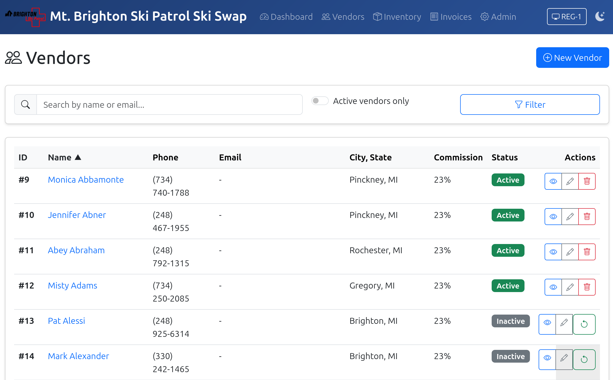
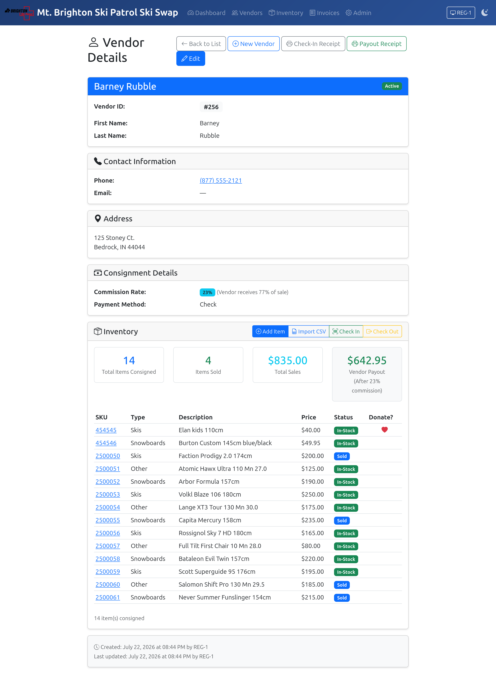
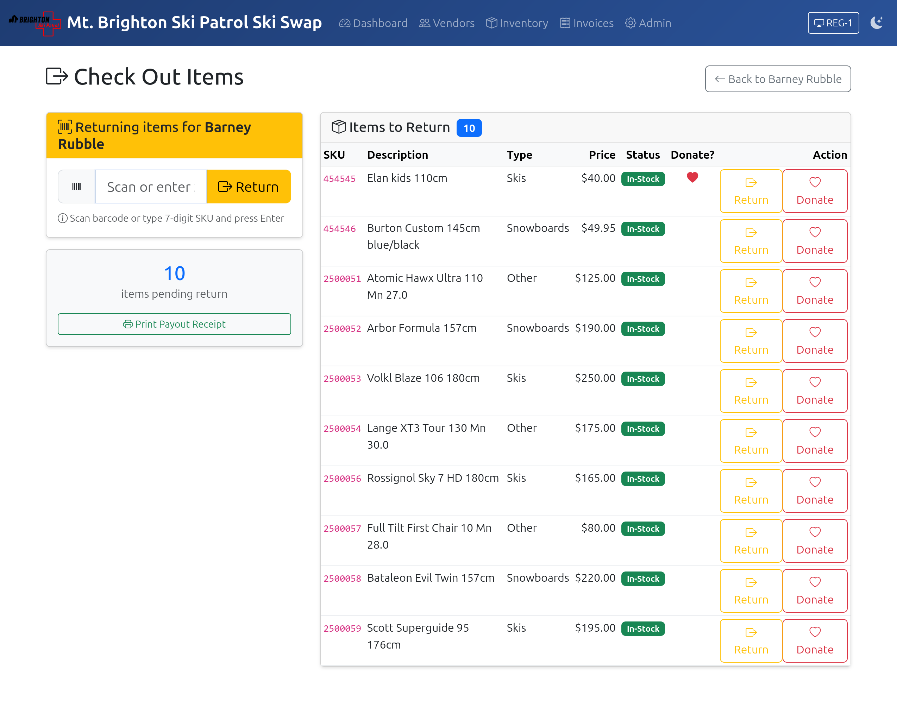
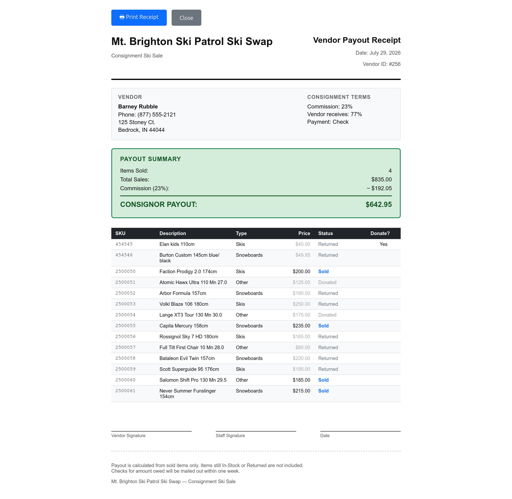

# Vendor Checkout

At the end of the sale, vendors will return to pick up any of their items that have not sold. They should bring back the receipt they were given at check in, or provide appropriate identification. 

Start by looking up the Vendor's record. Click the Vendors tab at the top of the screen to bring up the list of vendors.

Locate the vendor in the list by entering any portion of the name in the search box and clicking the Filter button. Alternatively, you can just scroll down the list, which is in order by the vendor's last name. 

When you have located the vendor, click the name to open the Vendor Detail page.

In the Inventory section, you will see which items have been sold, and which are still in stock. Let the vendor know which items are not sold and ask them to find them on the sales floor and bring them back for check out. Our staff can assist with locating items. Items that have the Donate? column set do not need to be picked up by the vendor, and will be donated. 

When the vendor returns with the items they are picking up, click the Check-Out button at the top of the Inventory section of the Vendor Details. 

Scan each item that the vendor is picking up. This will mark the items **Returned to Vendor**. You may also click the **Return** button to the right of the item in the item list. For any item that is to be donated, click the **Donate** button to the right of the item in the list. As each item is returned or donated, it will be removed from the list. You need to make sure to action each item in the list; no items should be left in **In Stock** status. When all items are taken off the list, click the **Print Payout Receipt** button at the bottom of the left column. 

Print out the payout receipt, and give it to the vendor. Explain the total they will receive (total sales minus our commission), and let them know that we will mail checks on the first business day after the swap, and they should receive it within a week.