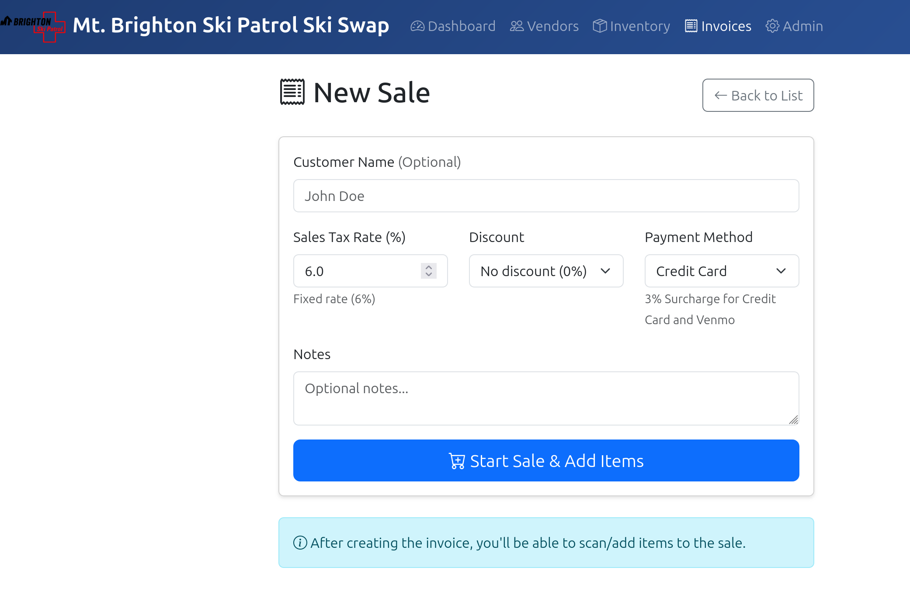
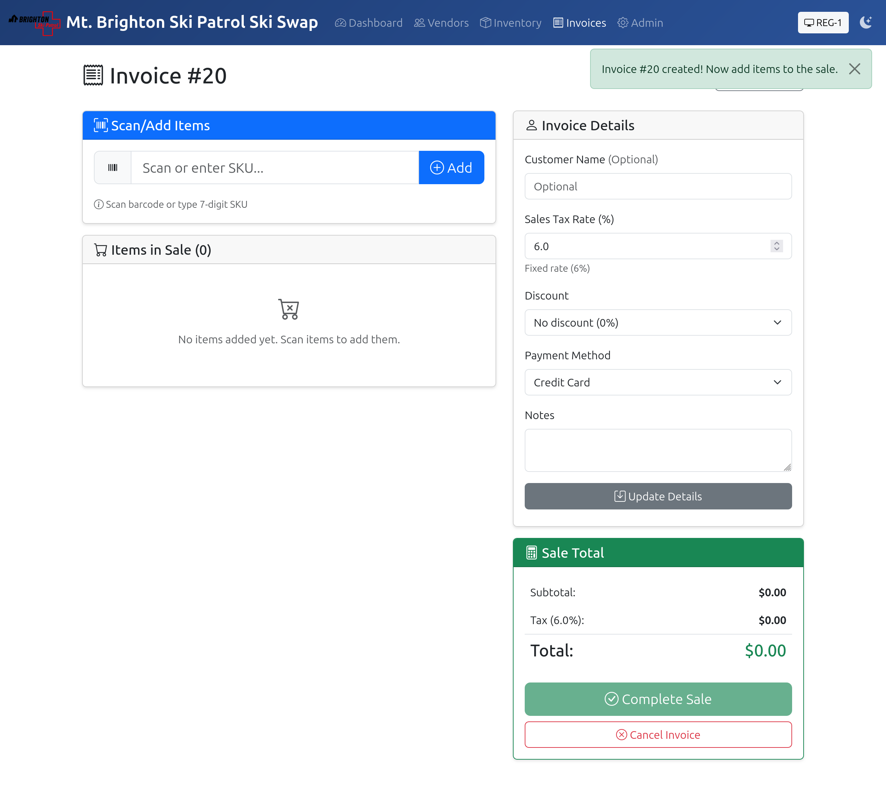
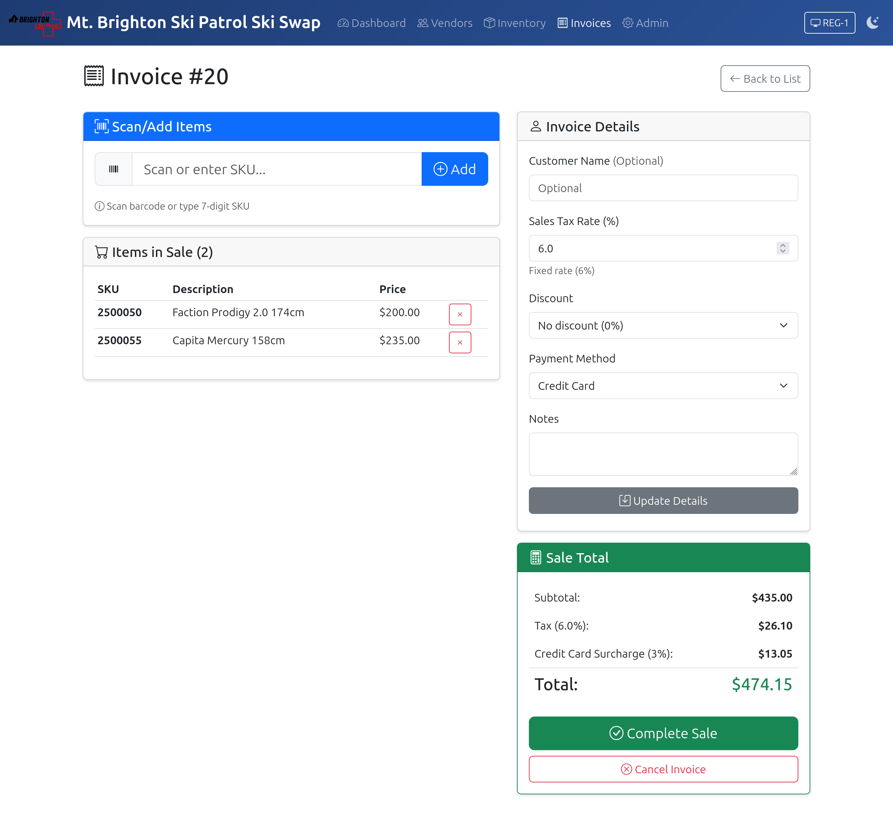
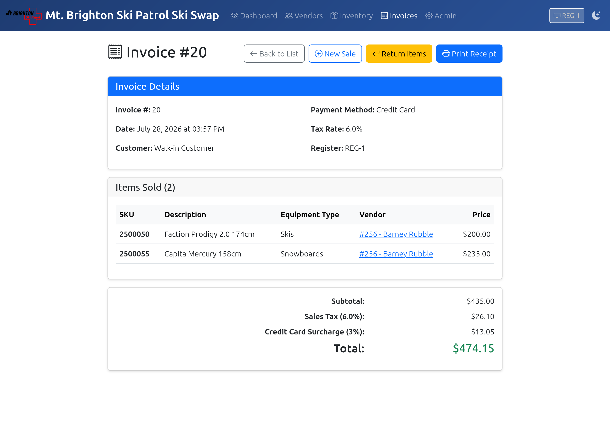
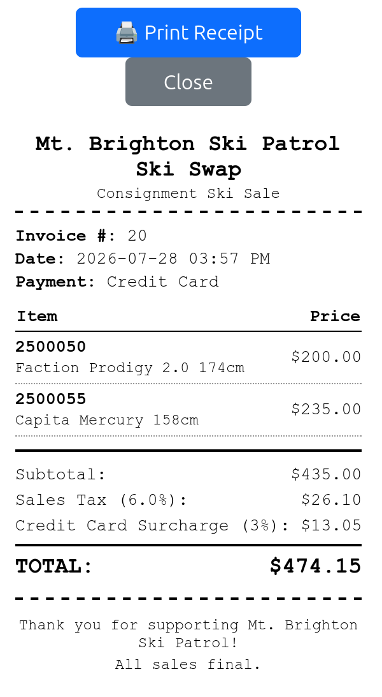

# Processing a Sale

Set your **Register ID** — click the register button in the top navbar (yellow if unset). You only need to do this once per browser session.

Click **New Sale** on the Dashboard or the Invoices page. 

Enter the customer's name. Required for Employee discount, optional for all others (and we normally don't collect it). Sales Tax Rate is fixed at 6%.

Apply a **Discount** if the customer is an employee or volunteer:
   - Select "Employee discount (10%)" from the dropdown

Select the **Payment Method**:
   - Cash, Check — no surcharge
   - Credit Card, Venmo — a 3% surcharge is added automatically

Notes are optional and normally not required.

When all data is entered, click the Start Sale & Add Items button:

Add items by typing or scanning the **SKU number** and clicking **Add**
   - The item description and price appear in the cart
   - Items must be **In-Stock** to be added
   - If an item is added in error, it can be removed by clicking the red 'X' next to the items price.

Review the totals (subtotal, discount if any, tax, surcharge if any, total)

Click **Complete Sale**

On the invoice view page, click **Print Receipt** to open the receipt and print it.

> Use the browser's Print dialog and select the correct printer. Select the receipt printer that is closest to your workstation.

---

## Handling Errors

| Problem | What to do |
|---------|-----------|
| SKU not found | Verify the tag; the item may not be checked in yet |
| Item already sold | The item has been purchased; check with a supervisor |
| Item is Pending | It is in another open cart; check with a supervisor |
| Wrong item added | Use the **Remove** button next to the item in the cart |

---