# Volunteer & Cashier User Guide

This guide covers the tasks a cashier or general volunteer will perform during the sale.

## Logging In

The application does not require a login — anyone with access to the URL can use it.

The app is typically available at **http://\<hostname\>:5000** on the local network. We will have a shortcut for this URL set up on all workstations, so you can connect with one click. Upon opening the app, the Dashboard screen will be displayed - 
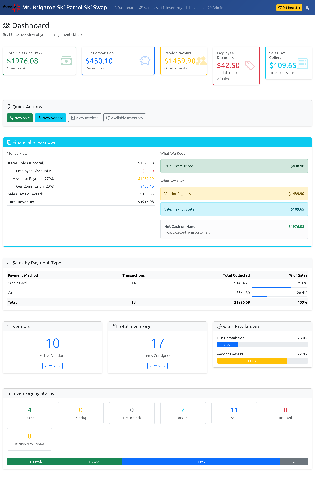
Before entering any data in the system, you will need to set your Register ID. Click the yellow "Set Register" button in the upper right of the screen, and key in the ID indicated on your workstation. You only need to do this once per browser session.
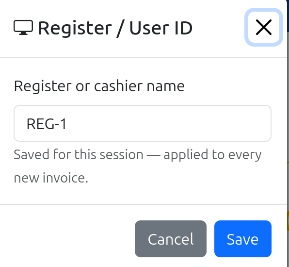

---
## Entering a Vendor and Items

### Vendors
When a vendor arrives at your workstation, they should have already been assisted by our staff in filling out their consignment contract (AKA "white sheet"), and getting all of their items priced and tagged with barcodes. Our database contains people who have sold with us over the past several years. So if the person is already in our vendor list, you can simply mark them active and proceed to entering their items. 

Start by clicking on the Vendors link at the top of the screen. 
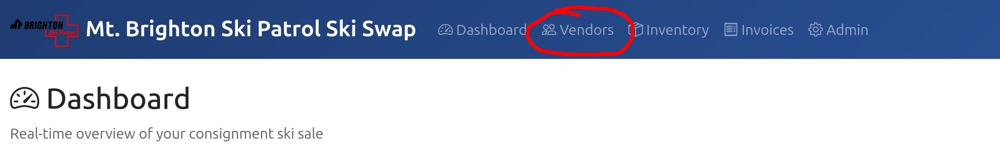
Which takes you to the vendor list

Ask the person if they've sold with us in the past few years. If you can search for them by name by typing in the first or last name in the search box, and clicking the Filter button. Matching vendors will be listed as shown below.
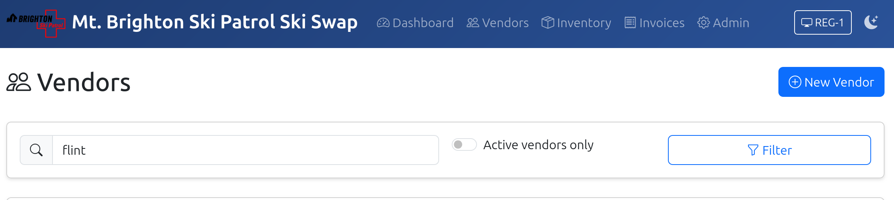
...then...
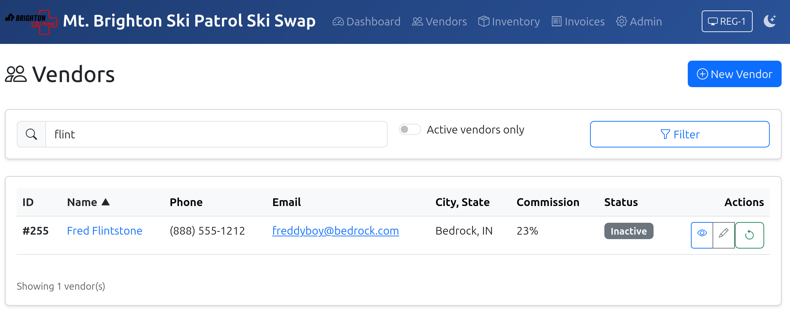
If the vendor is found, you can click on the "Reactivate" button under the Actions column (it is the icon on the far right) to make the vendor active.
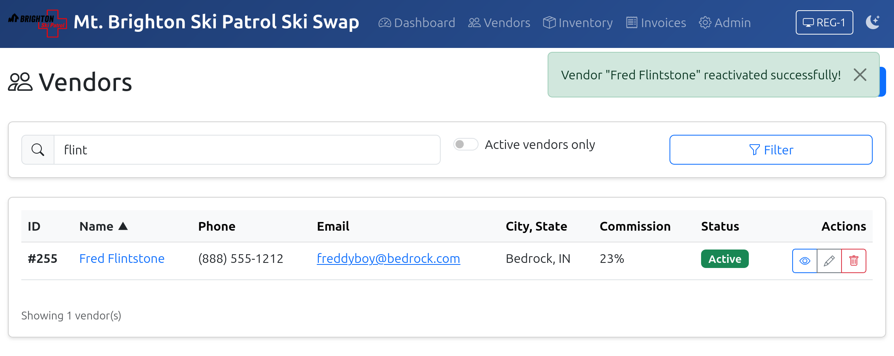
If the vendor is not found, or has not sold at prior swaps, you will need to add them as a new vendor. Click the New vendor button at the top of the Vendors screen to open the New Vendor screen. 
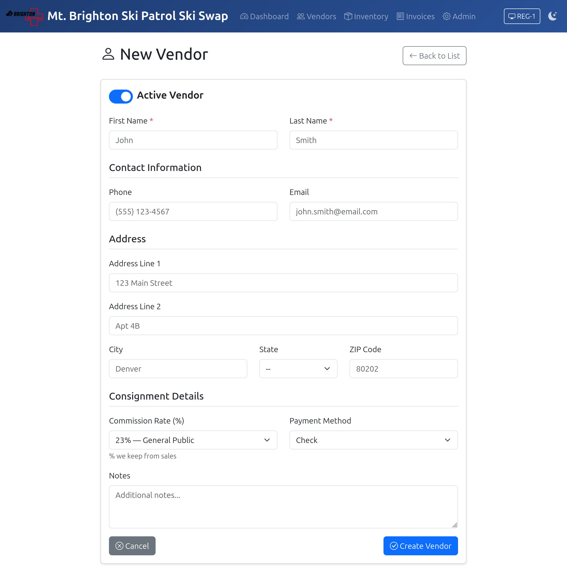
Enter the vendor's name, address and phone number. Email address is optional. Make sure the mailing address is accurate, because checks will be mailed out to vendors. 
Under Consignment Details, leave the Commission Rate at 23% for most people. The exception will be patrolers who will get the lower rate of 15%. Leave the Payment Method at Check. This is the only method we support for now.

When all data has been entered, click the Create Vendor button at the bottom of the page. When the vendor is created, you will see the Vendor Detail page. 
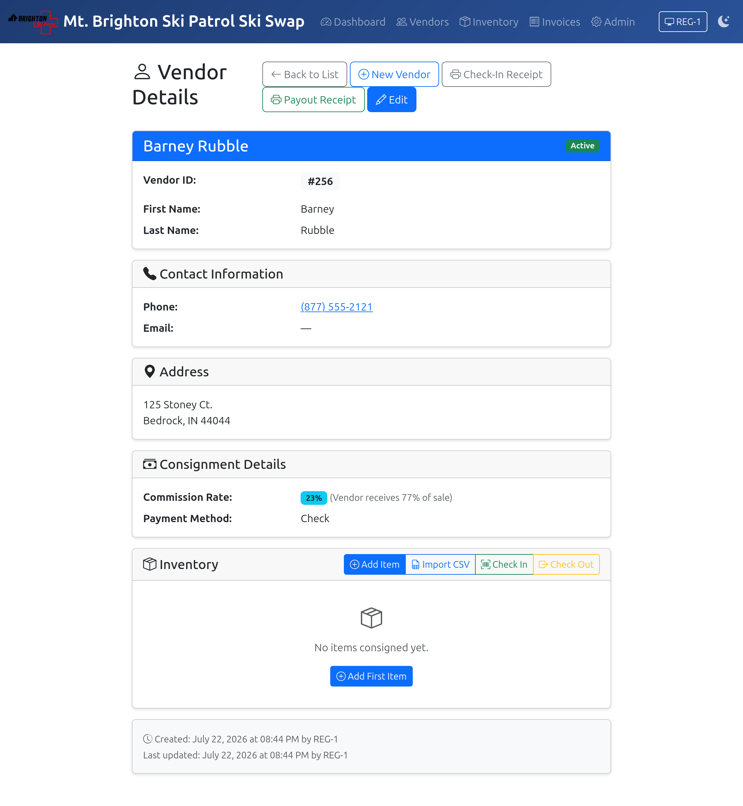

### Enter Items
From the Vendor Detais, click the Add Item button
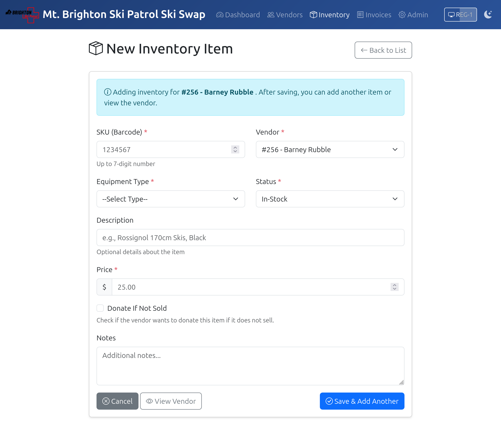
Position the cursor on the SKU field and **scan** the barcode of the item you are entering. This helps assure that the barcode is readable, and also helps avoid keying errors. 

Select the Equipment Type from the drop-down. You can start typing to limit the options shown. Leave the status as In-Stock. Type in a description of the item, and be as detailed as possible. Enter the price, and finally, check the Donate if Not Sold box if the item is to be donated. The Notes field is optional and not really used at this point. Click Save and Add Another when done. You will be put back to the Add Item screen so you can add another item for this vendor. When you have entered all items for the vendor, click the View Vendor button to go back to the Vendor Details. You should now see all of the items entered for the vendor. 
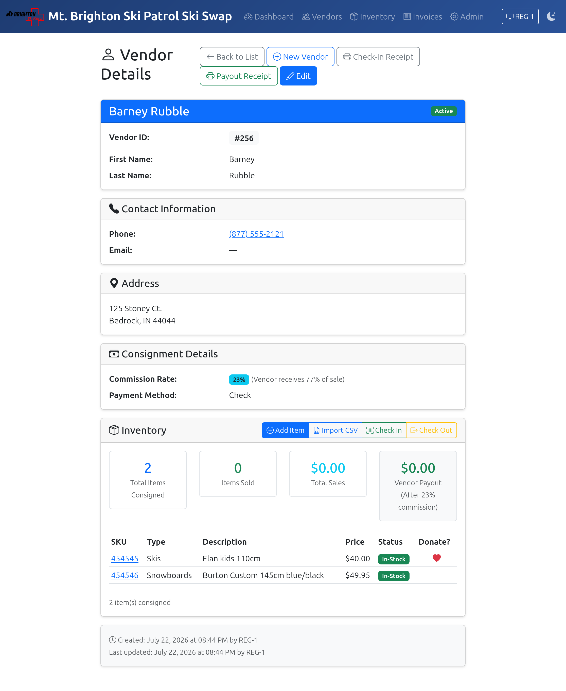
At the top of the screen, click the Check-in Receipt to print the receipt, and give it to the vendor. 
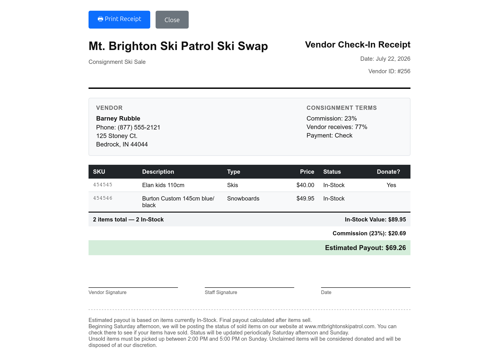
Keep and file the vendor's signed consignment agreement. 

## Processing a Sale

1. Set your **Register ID** — click the register button in the top navbar (yellow if unset). You only need to do this once per browser session.
2. Click **New Sale** on the Dashboard or the Invoices page
3. Enter the customer's name. Required for Employee discount, optional for all others.
4. Select the **Payment Method**:
   - Cash, Check — no surcharge
   - Credit Card, Venmo — a 3% surcharge is added automatically
5. Apply a **Discount** if the customer is an employee or volunteer:
   - Select "Employee discount (10%)" from the dropdown
6. Add items by typing or scanning the **SKU number** and clicking **Add Item**
   - The item description and price appear in the cart
   - Items must be **In-Stock** to be added
7. Review the totals (subtotal, discount if any, tax, surcharge if any, total)
8. Click **Complete Sale**
9. On the invoice view page, click **Print Receipt** to open the receipt and print it

---

### Handling Errors

| Problem | What to do |
|---------|-----------|
| SKU not found | Verify the tag; the item may not be checked in yet |
| Item already sold | The item has been purchased; check with a supervisor |
| Item is Pending | It is in another open cart; check with a supervisor |
| Wrong item added | Use the **Remove** button next to the item in the cart |

---

## CSV Import Format (Check-In)

If vendors submit a pre-filled spreadsheet, it must be a `.csv` file with these columns:

| Column | Required | Notes |
|--------|----------|-------|
| `sku` | Yes | Integer, 1–9999999 |
| `description` | No | Free text |
| `equipment_type` | No | See list below |
| `price` | Yes | Numeric; dollar sign optional (e.g. `25` or `$25.00`) |
| `donate_if_unsold` | No | `true` / `false` |

**Equipment types:** Ski, Boot, Binding, Pole, Helmet, Outerwear, Goggle, Other

Rows with missing prices, duplicate SKUs, or invalid SKUs are skipped with an error message.

---

## Printing Receipts

- **Customer receipt:** Invoice view page → **Print Receipt**
  - Formatted for the 80mm thermal receipt printer
- **Vendor check-in receipt:** Vendor page → Check In → **Print Receipt**
- **Vendor payout receipt:** Vendor page → Check Out → **Print Receipt**

> Use the browser's Print dialog and select the correct printer.
